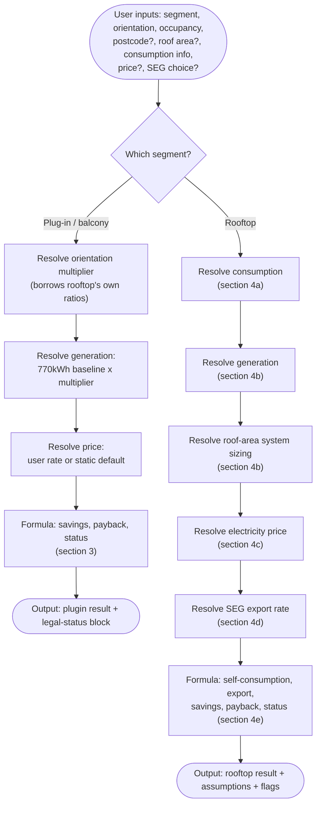
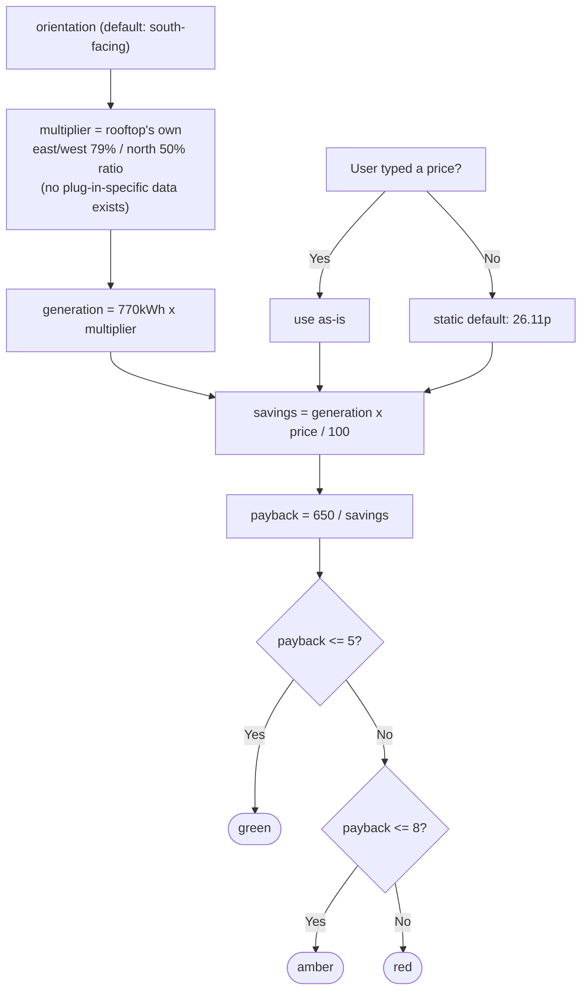
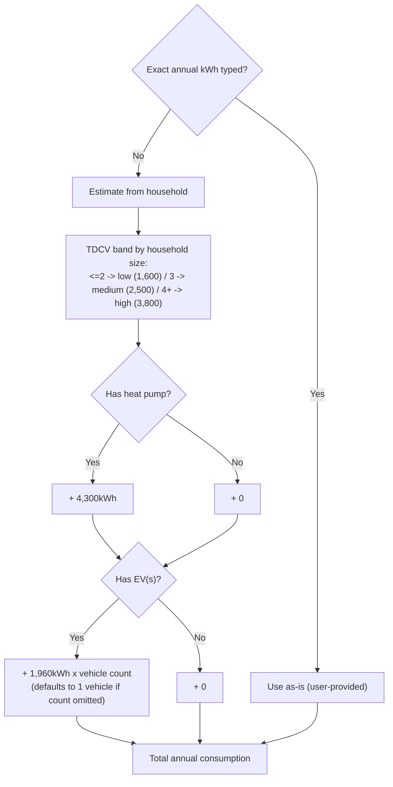
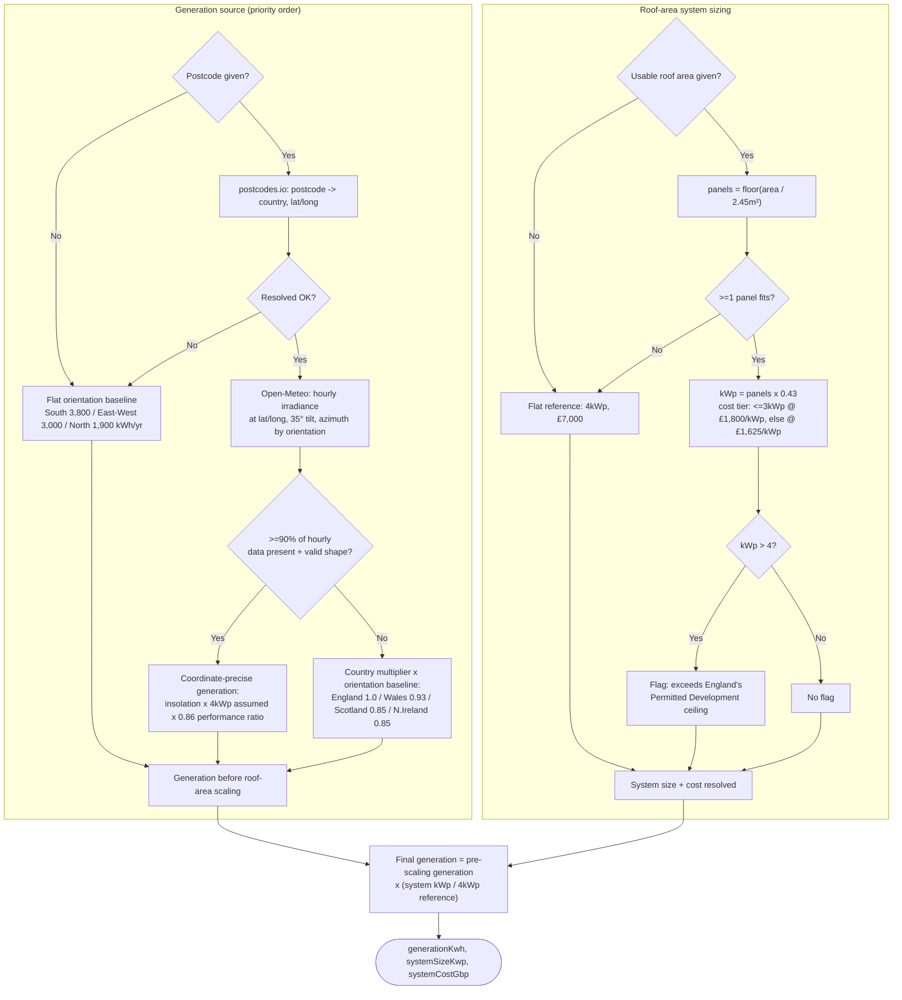
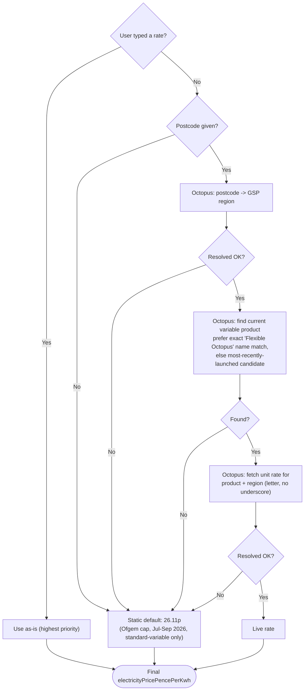
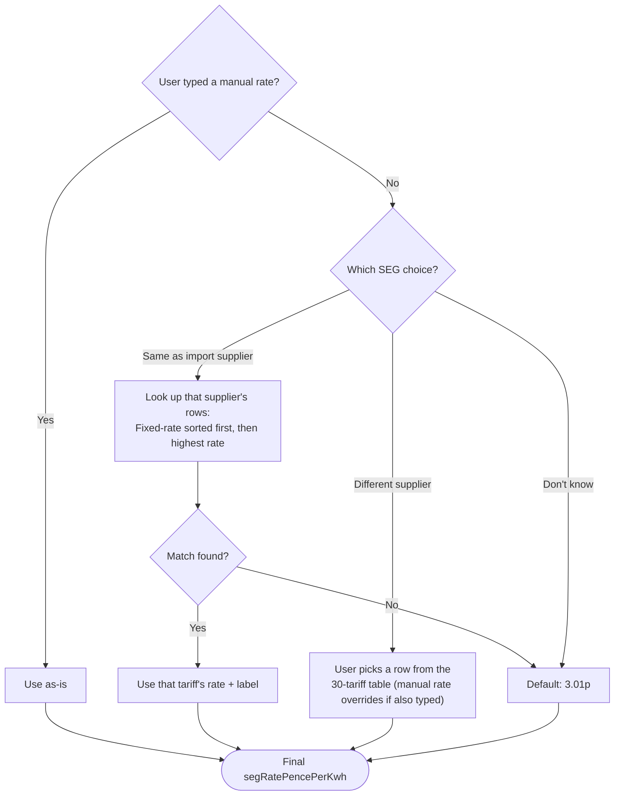
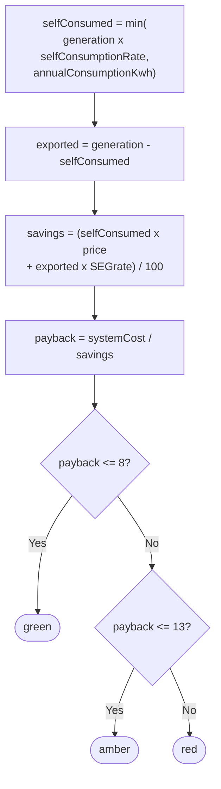

# SunnySideUp calculator — calculation logic

## What this document is

A description of how `calculator.js` actually turns user inputs into a green/amber/red
viability result — the decision logic and formulas, not the sourcing arguments. Written to
be read by a human and by an AI reviewing whether this is *good* logic (correct formulas,
sensible fallback order, reasonable thresholds), as a follow-up pass to this one.

**What this document is not:** a sourcing/citation document. Every constant below names its
confidence tier (Fact / Inference / Assumption) so a reviewer knows how solid each number is,
but the full "why this source, not an alternative" reasoning lives in `calculator.js`'s own
comments and in `grounding-research.md` — this document doesn't repeat it. If a review of this
logic changes a formula or a fallback order, that's a code change in `calculator.js`; if it
changes a constant's value, that's also a `calculator.js` change with its own sourcing note.

**Source of truth:** `calculator.js` as of this document's writing (25 July 2026, after the
Octopus live-fetch bug fixes on `claude/sunnysideup-intake-flow-2h5vm1`). Line numbers below
are for cross-checking exact code, not required reading — this document should stand on its own.

**Where the decision logic actually lives:** `calculator.js` exports pure scoring functions
(`calculateRooftopViability`, `calculatePluginViability`) plus async lookup/estimate helpers.
Two decisions described below — "which consumption path" (exact figure vs. estimate) and
"which SEG choice" (same supplier / different supplier / don't know) — are made by the UI
wiring layer (`calculator-test-standalone.html`'s script), not inside `calculator.js` itself.
`calculator.js` only ever receives an already-resolved number plus, for SEG, an optional label
for display. This matters for review: changing *whether* a fallback fires is a UI-layer change;
changing *what the fallback value is* is a `calculator.js` change.

---

## 1. Entry points

| Function | Type | What it does |
|---|---|---|
| `calculateRooftopViability(inputs)` | sync, pure | Core rooftop formula. All inputs already resolved or intentionally omitted (falls back to flat defaults). |
| `calculateRooftopViabilityByPostcode(postcode, otherInputs)` | async | Resolves postcode-dependent inputs (generation via Open-Meteo, price via Octopus) first, then calls the function above. |
| `calculatePluginViability(inputs)` | sync, pure | Plug-in/balcony formula. No postcode dependency, no export modeled. |

---

## 2. Overview — both segments, top to bottom

---

## 3. Plug-in / balcony solar

The simpler of the two segments: no postcode dependency, no export mechanism (all generation
is treated as self-consumed, matching how the underlying source figures were reported), no
roof-area sizing (it's a fixed small kit).

**Key constants** (`calculator.js` L311-345, L349-361):

| Constant | Value | Tier | Note |
|---|---|---|---|
| `PLUGIN_KIT_COST_GBP` | £650 | Assumption — weakest-sourced figure in the calculator | Midpoint of reported £400-900 range; no government/MCS/consumer-body source |
| `PLUGIN_ANNUAL_GENERATION_KWH` | 770kWh/yr | Assumption, same caveat | Midpoint of reported 640-900kWh/yr range; treated as the south-facing baseline |
| orientation multiplier | 79% (E/W) / 50% (N) of south | Assumption stacked on Assumption | Borrowed from rooftop's own orientation ratios — no plug-in-specific orientation data exists |
| `PLUGIN_PAYBACK_THRESHOLDS` | green ≤5yr, amber ≤8yr | Design judgment, not cited | Loosely anchored to grounding-research.md's reported range |

Output also carries a static `PLUGIN_LEGAL_STATUS` block (electrician install legal since
2026-04-15 under BS 7671 Amendment 4 [Fact]; DIY self-install not legal until 2026-08-27 under
SI 2026/848 [Fact]; tenancy consent status unresolved — no relevant provision either way). This
isn't part of the calculation, but ships alongside it in the same result object.

---

## 4. Rooftop solar

### 4a. Consumption resolution (UI-layer decision + `calculator.js` estimator)

**Key constants** (`calculator.js` L433-469):

| Constant | Value | Tier | Note |
|---|---|---|---|
| TDCV bands | low 1,600 / medium 2,500 / high 3,800 kWh/yr | Fact | Ofgem TDCV, effective 1 Jul 2026. The household-size-to-band boundary rule itself (≤2/3/4+) is this calculator's own tie-breaking choice, not an Ofgem-published cutoff. |
| `HEAT_PUMP_ANNUAL_KWH_ESTIMATE` | 4,300kWh/yr | Inference | Calculated: ~12,000kWh/yr EST heat-demand assumption ÷ 2.78 DESNZ field-trial median SPF |
| `EV_ANNUAL_HOME_CHARGING_KWH_ESTIMATE` | 1,960kWh/yr per vehicle | Inference | Calculated: 8,900mi/yr DfT BEV mileage ÷ 3.5-4.3mi/kWh (Assumption-tier efficiency, no gov't source) × 85% Zap-Map home-charging share |

### 4b. Generation resolution + roof-area system sizing

**Key constants** (`calculator.js` L184-245, L287-292, L217-236, L723-727):

| Constant | Value | Tier | Note |
|---|---|---|---|
| `ROOFTOP_ANNUAL_GENERATION_KWH.southFacing` | 3,800kWh/yr | Assumption | Midpoint of researched 3,400-4,200kWh/yr range for a ~4kWp south-facing system |
| `...eastWestFacing` / `...northFacing` | 3,000 / 1,900 kWh/yr | Prototype estimate, not independently researched | Proportional estimate only |
| `REFERENCE_SYSTEM_SIZE_KWP` | 4kWp | Fact (reference point) | MCS's own reported UK average is 4.6kWp; the figures above were researched against "a 4kW system" |
| `ROOFTOP_SYSTEM_COST_GBP` (flat default) | £7,000 | Assumption | Industry range £5,500-8,700; close to MCS's 2025 average |
| `ROOF_AREA_PER_PANEL_M2` | 2.45m² | Inference | Derived from MCS-anchored range (typical 3-bed semi: 22-30m² usable roof fits 9-12 panels) |
| `PANEL_WATTAGE_KWP` | 0.43kWp/panel | Inference | Blended across old (350-400W) and new (425-460W) panel stock |
| `COST_PER_KWP_GBP_BY_TIER` | £1,800/kWp (≤3kWp) / £1,625/kWp (>3kWp) | Fact | MCS's own nonlinear installed-cost figures — smaller systems cost more per kWp |
| `PERMITTED_DEVELOPMENT_KWP_CEILING_ENGLAND` | 4kWp | Fact | England only; Scotland/Wales have separate, unresearched thresholds |
| Regional generation multiplier | England 1.0 / Wales 0.93 / Scotland 0.85 / N.Ireland 0.85 | England: baseline. Scotland: Inference. Wales, N.Ireland: Assumption — extrapolated | No Wales/N.Ireland-specific figure was found; both extrapolated from Scotland's climate/latitude band |
| Open-Meteo tilt / performance ratio / assumed peak power | 35° / 0.86 / 4kWp | Assumption (all three) | Same near-optimal-UK-roof and system-loss assumptions used throughout |

### 4c. Electricity price resolution

**Key constants / behavior** (`calculator.js` L43, L888-1012):

| Item | Value | Tier | Note |
|---|---|---|---|
| `ELECTRICITY_PRICE_PENCE_PER_KWH_DEFAULT` | 26.11p | Fact (default) | Ofgem price cap, Direct Debit standard variable tariff, 1 Jul-30 Sep 2026 — changes quarterly |
| Live Octopus rate | varies by region | Inference | Confirmed end-to-end via a direct-HTTP test across 4 real UK regions (25 Jul 2026) — see `calculator.js`'s comment on `OCTOPUS_BASE_URL` for the two bugs found and fixed during that test |
| Product-selection rule | exact "Flexible Octopus" name match, else most-recent `available_from` among filtered candidates | — | Candidates exclude green/tracker/prepay/business/restricted/expired products |
| Why Octopus's rate stands in for any supplier | — | Fact, empirically checked | 5 real (supplier, region) pairs landed within ~0.03p/kWh of Ofgem's regional cap — standard-variable tariffs are regulatorily pinned to the cap, unlike SEG export rates |

### 4d. SEG export rate resolution (UI-layer logic)

**Key constants** (`calculator.js` L81-173):

| Item | Value | Tier | Note |
|---|---|---|---|
| `SEG_RATE_PENCE_PER_KWH_DEFAULT` | 3.01p | Inference | Median of the 10 tariffs in `SEG_TARIFFS` explicitly "open to anyone, no switch needed" |
| `SEG_TARIFFS` table | 30 rows, £1.00-25.00p, named supplier/tariff/eligibility/source | Mixed — see table | User-provided CSV (23 Jul 2026); 9 rows spot-checked directly (2 confirmed Fact, e.g. Octopus's own "Outgoing Octopus" and "Smart Export Guarantee"; 7 turned up real mismatches, e.g. Ofgem's SEG register lists licensee names only, never rates); 21 rows still unchecked. Full per-row detail in `calculator.js`, not reproduced here. |
| Fixed-first sort rule | — | — | A structured field (`rateType`), not a parsed guess — surfaced a real issue where the numerically-highest row (Octopus's "Intelligent Octopus Flux") isn't actually a flat quotable rate |

### 4e. Core formula

**Key constants** (`calculator.js` L335-345):

| Constant | Value | Tier | Note |
|---|---|---|---|
| `SELF_CONSUMPTION_RATE` | usually-home 0.55 / usually-out 0.30 | Prototype simplification, not independently researched | Modeled from occupancy as a rough two-tier proxy — `grounding-research.md` names self-consumption rate as a real sensitivity factor but doesn't supply a researched percentage |
| `ROOFTOP_PAYBACK_THRESHOLDS` | green ≤8yr, amber ≤13yr | Design judgment, not cited | Loosely anchored to `grounding-research.md`'s reported "roughly 6-14 years across sources" range, not a regulator or industry-body standard |

---

## 5. What comes back alongside the number

Every result carries an `assumptions` object naming each input's resolved value, confidence
tier, and a plain-language note — so a user (or a future reviewer) can see exactly which parts
of a given result are Fact-backed vs. Assumption-backed, not just the final figure. Rooftop
results additionally carry, when applicable: `postcodeLookup`, `openMeteoLookup`,
`electricityPriceLookup` (each `{ ok, error? }`, so a failed live lookup is visible rather than
silently masked by its fallback), `roofAreaSizing`, `permittedDevelopmentFlag`, and
`regulatoryFlag` (Scotland/Wales — permitted-development regime not researched for those
countries).

---

## 6. Simplifications already flagged in the code

Pulled from `calculator.js`'s own comments, not new critique — worth having in one place for
the next review pass to weigh in on:

- **Self-consumption rate** is a rough two-tier occupancy proxy (0.55 / 0.30), not an
  independently researched behavioral figure.
- **Plug-in generation and kit cost** are the weakest-sourced figures in the calculator — no
  government, MCS, or established consumer-body source for either.
- **Plug-in orientation multiplier** stacks one Assumption on another: it borrows rooftop's
  own east/west and north ratios because no plug-in-specific orientation data exists at all.
- **East/west and north-facing rooftop generation** figures are a prototype-only proportional
  estimate, not independently researched the way the south-facing figure is.
- **Payback thresholds** (both segments) are a design judgment loosely anchored to the
  researched payback range, not a cited industry or regulatory standard.
- **21 of 30 rows** in the SEG tariff table are still unverified against their named source.
- **Wales and Northern Ireland** regional generation multipliers are extrapolated from
  Scotland's climate/latitude band, not independently found.
- **Scotland and Wales** permitted-development/building-regulation regimes for solar are
  flagged as unresearched, not silently assumed equivalent to England's.
