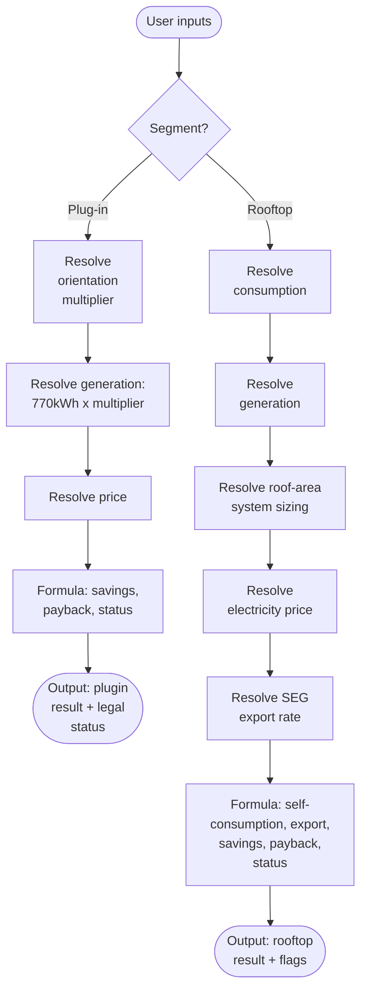
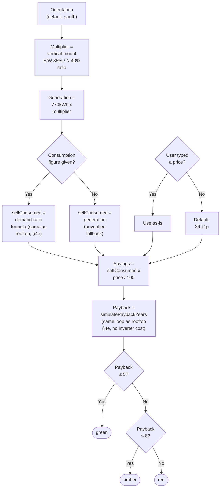
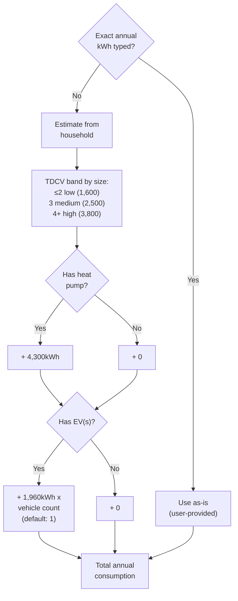
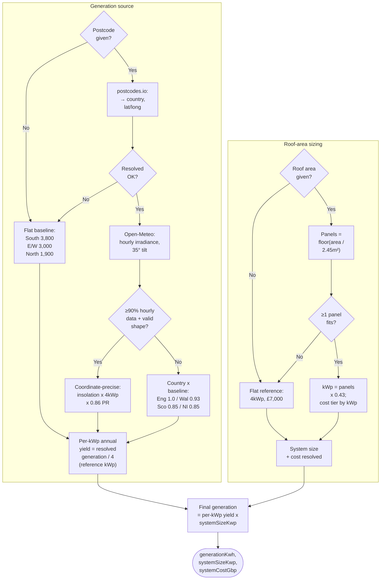
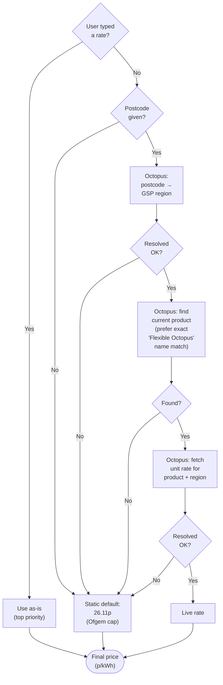
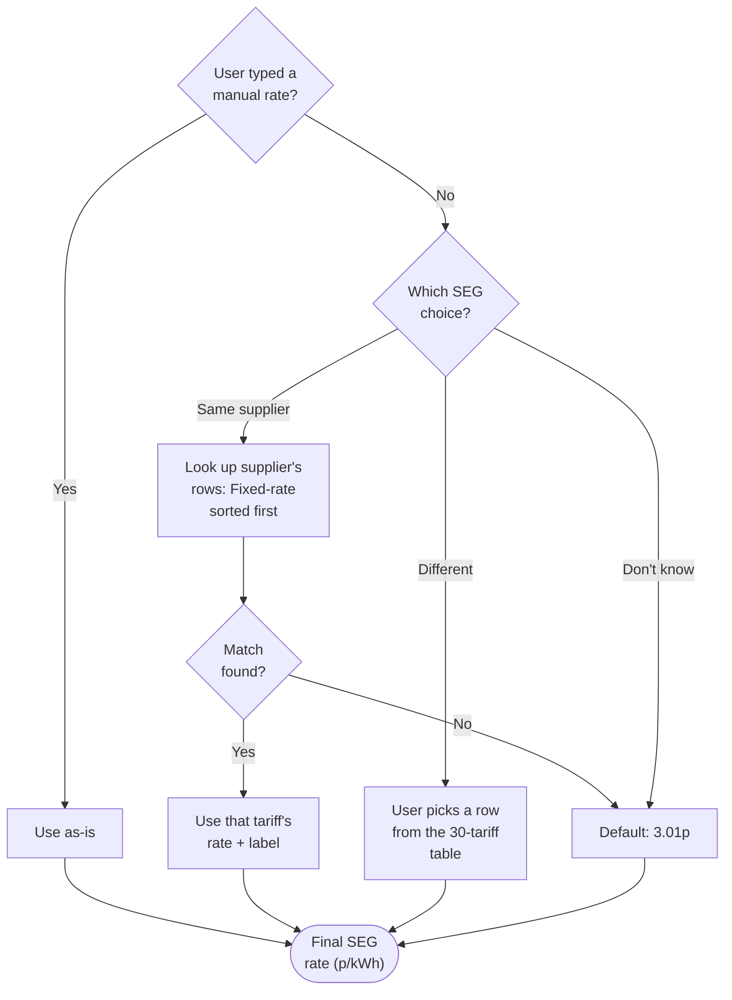
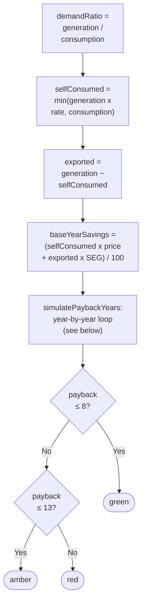
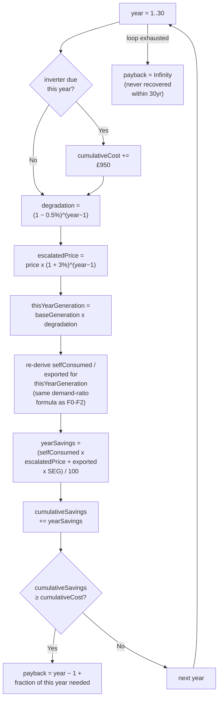

# SunnySideUp calculator - calculation logic

## What this document is

A description of how `calculator.js` actually turns user inputs into a green/amber/red
viability result: the decision logic and formulas, not the sourcing arguments. Written to
be read by a human and by an AI reviewing whether this is *good* logic (correct formulas,
sensible fallback order, reasonable thresholds), as a follow-up pass to this one.

**What this document is not:** a sourcing/citation document. Every constant below names its
confidence tier (Fact / Inference / Assumption) so a reviewer knows how solid each number is,
but the full "why this source, not an alternative" reasoning lives in `calculator.js`'s own
comments and in `grounding-research.md`; this document doesn't repeat it. If a review of this
logic changes a formula or a fallback order, that's a code change in `calculator.js`; if it
changes a constant's value, that's also a `calculator.js` change with its own sourcing note.

**Source of truth:** `calculator.js` as of this document's writing (25 July 2026, after the
Octopus live-fetch bug fixes on `claude/sunnysideup-intake-flow-2h5vm1`). Line numbers below
are for cross-checking exact code, not required reading. This document should stand on its own.

**Where the decision logic actually lives:** `calculator.js` exports pure scoring functions
(`calculateRooftopViability`, `calculatePluginViability`) plus async lookup/estimate helpers.
Two decisions described below, "which consumption path" (exact figure vs. estimate) and
"which SEG choice" (same supplier / different supplier / don't know), are made by the UI
wiring layer (`calculator-test-standalone.html`'s script), not inside `calculator.js` itself.
`calculator.js` only ever receives an already-resolved number plus, for SEG, an optional label
for display. This matters for review: changing *whether* a fallback fires is a UI-layer change;
changing *what the fallback value is* is a `calculator.js` change.

---

## 1. Entry points

| Function | Type | What it does |
|---|---|---|
| `calculateRooftopViability(inputs)` | sync, pure | Core rooftop formula. All inputs already resolved or intentionally omitted (falls back to flat defaults). |
| `calculateRooftopViabilityByPostcode(postcode, otherInputs)` | async | Resolves postcode-dependent inputs (generation via Open-Meteo, price via Octopus) first, then calls the function above. |
| `calculatePluginViability(inputs)` | sync, pure | Plug-in/balcony formula. No postcode dependency, no export modeled. |

---

## 2. Overview: both segments, top to bottom

Each stage is detailed in the matching section below: §3 for plug-in, §4a-4e for rooftop.

---

## 3. Plug-in / balcony solar

The simpler of the two segments: no postcode dependency, no roof-area sizing (it's a fixed small
kit). No export mechanism still, but as of 1 Aug 2026, generation beyond what the household
self-consumes is no longer credited as savings — see the correction note below the flowchart.

**Key constants** (`calculator.js`, plug-in constants + `calculatePluginViability`):

| Constant | Value | Tier | Note |
|---|---|---|---|
| `PLUGIN_KIT_COST_GBP` | £650 | Assumption, weakest-sourced figure in the calculator | Midpoint of reported £400-900 range; no government/MCS/consumer-body source |
| `PLUGIN_ANNUAL_GENERATION_KWH` | 770kWh/yr | Assumption, same caveat | Midpoint of reported 640-900kWh/yr range; treated as the south-facing baseline. Own mounting-tilt assumption unverified — see correction note below |
| `PLUGIN_VERTICAL_ORIENTATION_MULTIPLIER` | 85% (E/W) / 40% (N) of south | Inference (tilt-loss magnitude) / Assumption (orientation-specific ratios) | Corrected 1 Aug 2026 from rooftop's borrowed 79%/50% ratios (calibrated to rooftop's ~35° tilt) to vertical-mount-specific figures — see correction note below |
| self-consumption rate | Demand-ratio formula (if consumption given) / 100% (fallback) | Inference / Assumption | Same `selfConsumptionFactorFromDemandRatio` as rooftop §4e when `annualConsumptionKwh` is provided; falls back to the old fully-self-consumed assumption otherwise, now explicitly flagged rather than silent |
| `PLUGIN_PAYBACK_THRESHOLDS` | green ≤5yr, amber ≤8yr | Design judgment, not cited | Loosely anchored to grounding-research.md's reported range. Named as a design judgment (not a personalized recommendation) in every result's `assumptions.paybackYears`, added 1 Aug 2026 — same fix as rooftop §4e. Payback is simulated with the same price-escalation/degradation assumptions as rooftop (a general PV/market assumption, not rooftop-specific), but with no inverter-replacement cost (no cost research exists at plug-in's much smaller scale) |

> Corrected 1 Aug 2026: this segment previously treated 100% of generation as self-consumed
> unconditionally, with no export/unmet-demand concept at all — not a sourcing gap like the
> constants above, but a real modeling gap. Plug-in kits have no export meter or SEG tracking, so a
> household away during the day got nothing for a midday generation spike exceeding its baseload
> demand: that surplus is fed to the grid for free, not banked as savings, yet the old model counted
> it as if it were. `calculatePluginViability` now accepts an optional `annualConsumptionKwh`
> (threaded through from the same consumption resolution the UI already does for rooftop, in
> `prototype.html`'s `runCalculation()`); when given, self-consumption is computed the same way as
> rooftop's demand-ratio formula, and any generation beyond that rate earns nothing. When
> `annualConsumptionKwh` isn't given, the function still falls back to the old fully-self-consumed
> assumption (a plug-in kit's onboarding may be lighter-weight than rooftop's, so this input stays
> optional) — but that fallback is now a `pluginSelfConsumptionUnverified` flag on the result, not a
> silent default. If consumption *is* given and a meaningful share (>15%) of generation is still
> projected to go unused, a separate `pluginUnselfConsumedShare` flag names the real amount involved.

<!-- -->

> Corrected 1 Aug 2026 (a second, separate fix in the same pass): the orientation multiplier
> previously reused rooftop's own east/west ≈79% and north ≈50% ratios, which reflect losses at
> rooftop's own ~35° tilt (see §4b's `OPEN_METEO_TILT_ANGLE_DEGREES`), not the mounting angle a
> plug-in kit actually uses — real plug-in kits are typically mounted near-vertical (balcony rail,
> wall bracket), and vertical mounts have a genuinely different azimuth-sensitivity curve than a
> ~35°-tilt rooftop. Checked directly: two independent UK sources, each citing PVGIS modeling, put
> vertical (90°) mounting at roughly 70-74% of an optimally-tilted rooftop panel's output for the
> same south orientation (one cross-checks almost exactly against this file's own
> `ROOFTOP_ANNUAL_GENERATION_KWH.southFacing` figure at rooftop scale — 3,800kWh pitched vs
> ~2,800kWh vertical, a genuine independent confirmation, not just a coincidence of rounding). That
> range describes the overall tilt-mismatch risk sitting inside `PLUGIN_ANNUAL_GENERATION_KWH`'s own
> south-facing baseline — deliberately **not** applied to discount that number, since the weak
> original 640-900kWh/yr sources never stated a mounting angle either, and there's no way to tell
> whether they already reflect real vertical-mount output or an idealized tilt. Silently applying a
> 70-74% haircut on top of an already-ambiguous number risks double-counting an effect that might
> already be baked in; surfaced instead as an explicit caveat in the south-facing case's
> `assumptions.generationKwh.note`, not a silent correction.

What *is* now corrected with real numbers: `PLUGIN_VERTICAL_ORIENTATION_MULTIPLIER`, a
vertical-mount-specific east/west and north ratio, replacing the borrowed rooftop figures.
UK consumer-guide sources (weaker sourcing than the tilt-loss figure above — no explicit PVGIS
citation for these specific numbers, and near-identical figures recurring across multiple similar
sites in a way that suggests shared rather than independent sourcing) put vertical east/west walls
around 15-20% below vertical south (≈80-85% of south) and vertical north walls well under half of
vertical south (one source: under 1,000kWh/yr against a ~2,300kWh/yr vertical-south figure at a
larger system scale, ≈43% or lower). The east/west result is a genuine surprise worth naming
directly: vertical mounting is *less* orientation-sensitive east/west than rooftop's own 79% ratio
implied (85% vs 79%), not more — the original critique's "vertical mounts suffer steeper losses"
framing holds for north specifically (40% vs rooftop's 50%), but not uniformly across every
orientation. Not a single "vertical is always worse" correction; a genuinely different relationship
per orientation.

Output also carries a static `PLUGIN_LEGAL_STATUS` block (electrician install legal since
2026-04-15 under BS 7671 Amendment 4 [Fact]; DIY self-install not legal until 2026-08-27 under
SI 2026/848 [Fact]; tenancy consent status unresolved, no relevant provision either way). This
isn't part of the calculation, but ships alongside it in the same result object.

---

## 4. Rooftop solar

### 4a. Consumption resolution (UI-layer decision + `calculator.js` estimator)

**Key constants** (`calculator.js` L433-469):

| Constant | Value | Tier | Note |
|---|---|---|---|
| TDCV bands | low 1,600 / medium 2,500 / high 3,800 kWh/yr | Fact | Ofgem TDCV, effective 1 Jul 2026. The household-size-to-band boundary rule itself (≤2/3/4+) is this calculator's own tie-breaking choice, not an Ofgem-published cutoff. Named 4 Aug 2026 (found by a third-party review): a deeper issue than the boundary itself — the bands are described by *dwelling* size ("flat/1-bed," "2-3 bed," "4+ bed") but selected here purely from *occupant count*, two different variables treated as one. Four adults in a 2-bed flat get the "4+ bedroom house" band. Not fixed with a new dwelling-size input (a bigger scope change); named explicitly in the result's own `assumptions`/breakdown note instead of left inside the more general boundary-cutoff caveat. |
| `HEAT_PUMP_ANNUAL_KWH_ESTIMATE` | 4,300kWh/yr | Inference | Calculated: ~12,000kWh/yr EST heat-demand assumption ÷ 2.78 DESNZ field-trial median SPF |
| `EV_ANNUAL_HOME_CHARGING_KWH_ESTIMATE` | 1,960kWh/yr per vehicle | Inference | Calculated: 8,900mi/yr DfT BEV mileage ÷ 3.5-4.3mi/kWh (Assumption-tier efficiency, no gov't source) × 85% Zap-Map home-charging share |

### 4b. Generation resolution + roof-area system sizing

Simplified 4 Aug 2026 (found by a third-party review, no behavior change — verified against the prior
implementation across 128 input combinations with zero mismatches): previously computed generation
for an assumed `REFERENCE_SYSTEM_SIZE_KWP` (4kWp) system first, then rescaled it by the ratio of the
real system size back to that same reference — a resolve-then-immediately-undo indirection, since
every generation source above (flat baseline, regional multiplier, Open-Meteo override) is already
calibrated to that one reference size. Now resolves a per-kWp annual yield once and multiplies
directly by the real system size at the end: the same physical quantity, one fewer conceptual hop.

**Key constants** (`calculator.js` L184-245, L287-292, L217-236, L723-727):

| Constant | Value | Tier | Note |
|---|---|---|---|
| `ROOFTOP_ANNUAL_GENERATION_KWH.southFacing` | 3,800kWh/yr | Assumption | Midpoint of researched 3,400-4,200kWh/yr range for a ~4kWp south-facing system |
| `...eastWestFacing` / `...northFacing` | 3,000 / 1,900 kWh/yr | Prototype estimate, not independently researched | Proportional estimate only |
| `REFERENCE_SYSTEM_SIZE_KWP` | 4kWp | Fact (reference point) | MCS's own reported UK average is 4.6kWp; the figures above were researched against "a 4kW system" |
| `ROOFTOP_SYSTEM_COST_GBP` (flat default) | £7,000 | Assumption | Industry range £5,500-8,700; close to MCS's 2025 average |
| `ROOF_AREA_PER_PANEL_M2` | 2.45m² | Inference | Derived from MCS-anchored range (typical 3-bed semi: 22-30m² usable roof fits 9-12 panels) |
| `PANEL_WATTAGE_KWP` | 0.43kWp/panel | Inference | Blended across old (350-400W) and new (425-460W) panel stock |
| `COST_PER_KWP_GBP_BY_TIER` | £1,800/kWp (≤3kWp) / £1,625/kWp (>3kWp) | Fact | MCS's own nonlinear installed-cost figures; smaller systems cost more per kWp |
| `DOMESTIC_SYSTEM_SIZE_SANITY_MAX_KWP` | 20kWp | N/A (a sanity cap, not a researched figure) | Added 4 Aug 2026, found by a third-party review. `COST_PER_KWP_GBP_BY_TIER` has no upper bound, so a very large roof-area-derived system still prices at the same flat >3kWp rate as an ordinary domestic install, extrapolating MCS-anchored research (4.6kWp UK average) well past where it was checked. Chosen generously (~4x the MCS average) so it only flags inputs clearly outside typical domestic scale, not a genuinely large detached-house roof. Surfaces a `roofAreaSizingExceedsDomesticScale` flag (§5), doesn't cap the input |

> Corrected 1 Aug 2026: this table previously included a `PERMITTED_DEVELOPMENT_KWP_CEILING_ENGLAND`
> constant (4kWp, tagged Fact), and the roof-area sizing flow above fired a "may need planning
> permission" flag whenever a roof-area-derived system exceeded it. That was wrong: the real GPDO
> 2015 Schedule 2 Part 14 Class J test for Permitted Development is physical (panel protrusion
> ≤200mm from the roof slope/wall, not projecting above the roof's highest point, not on a listed
> building — see `grounding-research.md` §Permitted development), not a kWp ceiling. No source in
> this project's own research ever supported a 4kWp figure for this purpose; it most likely got
> conflated with the unrelated G98 DNO grid-connection fast-track threshold (~3.68kW, see
> `grounding-research.md` §G98 vs G99), which governs when a supplier must be notified of a new
> connection, not planning law. Removed the constant and the size-triggered flag entirely, since
> there's no correct kWp number to replace it with — this calculator has no roof pitch, ridge
> height, or protrusion inputs to actually evaluate the real test. See §5's `permittedDevelopment`
> flag, now unconditional and stating the real criteria instead of a false determination.

<!-- -->

> Corrected 4 Aug 2026 (found by a third-party review): a `roofAreaM2` too small to fit even one
> panel (< `ROOF_AREA_PER_PANEL_M2`) previously fell through to the exact same flat-default path,
> with the exact same "give your usable roof area for a size-adjusted estimate" assumptions note, as
> someone who never answered the roof-area question at all — actively misleading for someone who
> just did. `estimateSystemSizeFromRoofArea` returning `null` in both cases meant
> `calculateRooftopViability` couldn't tell them apart. Now distinguished via a
> `roofAreaTooSmallForAnyPanel` check: the flat-default numbers are still used either way (there's no
> other system to size against), but a too-small area gets its own `roofAreaInsufficientForPanels`
> flag and assumptions note (§5) instead of the never-given case's note.

| Regional generation multiplier | England 1.0 / Wales 0.93 / Scotland 0.85 / N.Ireland 0.85 | England: baseline. Scotland: Inference. Wales, N.Ireland: Assumption, extrapolated | No Wales/N.Ireland-specific figure was found; both extrapolated from Scotland's climate/latitude band |
| Open-Meteo tilt / performance ratio / assumed peak power | 35° / 0.86 / 4kWp | Assumption (all three) | Same near-optimal-UK-roof and system-loss assumptions used throughout |

### 4c. Electricity price resolution

**Key constants / behavior** (`calculator.js` L43, L888-1012):

| Item | Value | Tier | Note |
|---|---|---|---|
| `ELECTRICITY_PRICE_PENCE_PER_KWH_DEFAULT` | 26.11p | Fact (default) | Ofgem price cap, Direct Debit standard variable tariff, 1 Jul-30 Sep 2026, changes quarterly |
| Live Octopus rate | varies by region | Inference | Confirmed end-to-end via a direct-HTTP test across 4 real UK regions (25 Jul 2026); see `calculator.js`'s comment on `OCTOPUS_BASE_URL` for the two bugs found and fixed during that test |
| Product-selection rule | exact "Flexible Octopus" name match, else most-recent `available_from` among filtered candidates | N/A | Candidates exclude green/tracker/prepay/business/restricted/expired products |
| Why Octopus's rate stands in for any supplier | N/A | Fact, empirically checked | 5 real (supplier, region) pairs landed within ~0.03p/kWh of Ofgem's regional cap; standard-variable tariffs are regulatorily pinned to the cap, unlike SEG export rates |
| `ELECTRICITY_PRICE_PLAUSIBLE_RANGE_PENCE_PER_KWH` | 5-100p/kWh | N/A (a sanity bound, not a researched figure) | Added 4 Aug 2026, found by a third-party review. A user-typed rate is this calculator's most-trusted input (top priority over every other source) but previously had no plausibility check at all; a typo could silently produce a result treated as more trustworthy than everything else in this file. Generous enough to cover real volatility (the 2022 UK energy crisis briefly pushed the price cap above 30p/kWh) while catching an obvious data-entry error. Not a hard block — surfaces an `electricityPriceUnusual` flag (§5), doesn't reject the input |

### 4d. SEG export rate resolution (UI-layer logic)

For the "different supplier" choice, a manually typed rate overrides the table selection if
both are filled in. Either resolution path also carries the picked row's eligibility text (e.g.
"requires system installed by that same supplier") into the final result; see §5. Added 4 Aug
2026 (found by a third-party review): that eligibility text is also checked for the word
"battery" — at least two `SEG_TARIFFS` rows require one, but this calculator has no battery input
or battery-aware self-consumption model anywhere, so picking one of those rows surfaces the
`segTariffRequiresBatteryNotModeled` flag (§5) rather than silently combining a battery-tied rate
with a no-battery physics model. A manually-typed rate (either "different supplier" or "same
supplier") is also checked against `SEG_RATE_PLAUSIBLE_RANGE_PENCE_PER_KWH` below and surfaces a
`segRateUnusual` flag (§5) if it falls outside it.

**Key constants** (`calculator.js` L81-173):

| Item | Value | Tier | Note |
|---|---|---|---|
| `SEG_RATE_PENCE_PER_KWH_DEFAULT` | 3.01p | Inference | Median of the 10 tariffs in `SEG_TARIFFS` explicitly "open to anyone, no switch needed" |
| `SEG_TARIFFS` table | 30 rows, £1.00-25.00p, named supplier/tariff/eligibility/source | Mixed, see table | User-provided CSV (23 Jul 2026); 9 rows spot-checked directly (2 confirmed Fact, e.g. Octopus's own "Outgoing Octopus" and "Smart Export Guarantee"; 7 turned up real mismatches, e.g. Ofgem's SEG register lists licensee names only, never rates); 21 rows still unchecked. Full per-row detail in `calculator.js`, not reproduced here. |
| Fixed-first sort rule | N/A | N/A | A structured field (`rateType`). It surfaced a real issue where the numerically-highest row (Octopus's "Intelligent Octopus Flux") isn't actually a flat quotable rate |
| `SEG_RATE_PLAUSIBLE_RANGE_PENCE_PER_KWH` | 0-50p/kWh | N/A (a sanity bound, not a researched figure) | Added 4 Aug 2026, found by a third-party review, same reasoning as `ELECTRICITY_PRICE_PLAUSIBLE_RANGE_PENCE_PER_KWH` (§4c). Roughly double `SEG_TARIFFS`' own 1.0-25.0p span — generous enough for a genuine outlier tariff, tight enough to catch an implausible entry. Not a hard block |

### 4e. Core formula

`rate` above (the self-consumption factor feeding F1) is no longer an occupancy lookup — see the
first correction note below. `simulatePaybackYears` (added 1 Aug 2026, replacing the flat
`systemCost / savings` division and the two-branch inverter-only adjustment that preceded it) runs
a year-by-year loop:

The self-consumed/exported split (`selfConsumed`/`exported`) is re-derived every year from that
year's own degraded generation, via the same `resolveGenerationSplit` helper §4e's headline year-1
figures use — not computed once at year 1 and decayed in parallel. See the correction note below.

**Key constants** (`calculator.js`, self-consumption formula + payback simulation):

| Constant | Value | Tier | Note |
|---|---|---|---|
| `SELF_CONSUMPTION_DEMAND_RATIO_COEFFICIENT` / `_EXPONENT` | 0.6748 / -0.703 | Fact (formula), Inference (annual application) | DESNZ Home Energy Model's own self-consumption formula (`HEM-TP-18`, gov.uk, fetched and extracted directly 1 Aug 2026): `factor = min(0.6748 x demandRatio^-0.703, 1)`, where `demandRatio = generation / consumption`. Derived from field data across a small UK dwelling sample, cross-checked against other datasets in HEM's own literature review. HEM applies this per timestep (sub-hourly); this calculator applies it once to the annual demand ratio, a coarser approximation. Reframed 4 Aug 2026 (found by a third-party review): the dominant version of that gap is seasonal, not within-day — UK solar generation swings roughly 10x by season while consumption doesn't, and this formula is convex over most of its uncapped range, so by Jensen's inequality, applying it once to an aggregated annual ratio tends to understate true self-consumption rather than approximate it with an unclear direction [Inference, this calculator's own adaptation, not re-run against HEM at monthly resolution] |
| `ROOFTOP_PAYBACK_THRESHOLDS` | green ≤8yr, amber ≤13yr | Design judgment, not cited | Loosely anchored to `grounding-research.md`'s reported "roughly 6-14 years across sources" range, not a regulator or industry-body standard. Named as a design judgment (not a personalized recommendation) in every result's `assumptions.paybackYears`, added 1 Aug 2026 — see the correction note below |
| `INVERTER_REPLACEMENT_COST_GBP` / `_YEAR` | £950 / year 12 | Assumption — consumer-guide convergence, no MCS/government source found | Added 1 Aug 2026. String inverter replacement commonly cited ~£700-1,200 incl. labour for a 3-4kWp system (£950 midpoint); typical lifespan 10-15yr (12 midpoint). Recurring: added again every 12 years the simulation runs, not just once |
| `ELECTRICITY_PRICE_ANNUAL_ESCALATION_RATE` | 3%/yr | Assumption — consumer-guide convergence on a commonly-used industry modeling figure | Added 1 Aug 2026. A primary DESNZ appraisal document ("Valuation of energy use and greenhouse gas emissions for appraisal," Nov 2023, gov.uk) was fetched and checked directly but its long-run price projections live in an accompanying spreadsheet not accessible from this session — no single quotable figure found there, so this falls back to industry-convergence sourcing (3-5% range cited). Applied only to the import price (self-consumed portion); SEG export rate is left flat, a named simplification |
| `PANEL_DEGRADATION_ANNUAL_RATE` | 0.5%/yr | Assumption — manufacturer-warranty/consumer-guide convergence | Added 1 Aug 2026. Commonly cited 0.3-0.8%/yr, retaining ~85-90% of output after 25 years; (1-0.005)^25 ≈ 88%, inside that range |
| `PAYBACK_SIMULATION_MAX_YEARS` | 30 | N/A (a safety cap, not a researched figure) | Matches commonly-cited panel working life; if payback isn't reached by then, the result is treated as not recovered within the panel's life (see `paybackNotReachedWithinSimulation` flag, §5) |

> Corrected 1 Aug 2026: this row previously read `SELF_CONSUMPTION_RATE`, a hardcoded two-tier
> occupancy lookup (usually-home 0.55 / usually-out 0.30), tagged "Prototype simplification, not
> independently researched." That mapping had a real gap the "self-consumption/occupancy" critique
> named directly: it couldn't reflect that a household with an EV or heat pump timed to run during
> daylight hours self-consumes more than one without, at the *same* occupancy pattern, since
> `annualConsumptionKwh` (which already includes heat pump/EV additions via
> `estimateAnnualConsumptionKwh`, §4a) never fed into the self-consumption number at all. The
> demand-ratio formula above fixes this mechanically: a higher annual consumption (from a heat pump
> or EV) lowers the demand ratio, which the formula translates into a higher self-consumption
> factor, without inventing a new unresearched per-appliance modifier. `occupancy` is no longer used
> to compute the number itself; see §5's new `occupancyMayLowerRealSelfConsumption` flag for how it's
> still used, as a caveat rather than an input to the formula.

<!-- -->

> Corrected 1 Aug 2026 (a second, separate fix in the same pass): the payback critique named two
> distinct problems with the thresholds above. First, payback tolerance is genuinely subjective —
> how long someone plans to own the property and how they weigh upfront cost against long-term
> saving both change what counts as a "good" payback, and no fixed cutoff can be right for everyone.
> This calculator doesn't try to personalize the thresholds (asking for a planned ownership horizon
> and inventing an unresearched horizon-to-tolerance mapping would just be a different, worse kind
> of false precision than the fixed cutoffs it would replace). Instead, every result now carries an
> explicit `assumptions.paybackYears` entry naming the thresholds as a design judgment and pointing
> back to the raw number, which was already the headline figure shown, not hidden behind the color.
> Second, the payback model ignored a real, quantifiable mid-life cost: inverter replacement. Panels
> themselves are typically warrantied well beyond 12 years, but a standard string inverter commonly
> needs replacing around then. Originally fixed (this same day) with a two-branch shortcut: if the
> naive `systemCost / savings` figure already exceeded `INVERTER_REPLACEMENT_YEAR`, re-solve for
> `(systemCost + INVERTER_REPLACEMENT_COST_GBP) / savings` instead, capped at one replacement cycle.
> That shortcut has since been superseded by the fuller simulation described below, which handles
> recurring replacements properly instead of an artificial one-cycle cap.

<!-- -->

> Corrected 1 Aug 2026 (a third, separate fix in the same pass, superseding the inverter-only
> shortcut above with a fuller model): both segments' payback previously used a single-year snapshot
> (this year's price, this year's generation) linearly annualized across a 10-25 year horizon — no
> price escalation, no panel degradation. A static rate isn't itself wrong for a same-year
> comparison, but stretching it across decades understates how solar's own value tends to compound:
> UK electricity prices have historically trended upward, so a flat-rate payback is, if anything,
> conservative on that front — the opposite of "inflating savings." Degradation cuts the other way.
> `simulatePaybackYears` now runs a year-by-year loop (see the second mermaid diagram above) that
> nets both effects plus recurring inverter replacement (rooftop only) into a single realistic
> payback figure, replacing the flat division and the two-branch inverter shortcut entirely. In
> practice, price escalation (3%/yr assumed) is bigger than degradation (0.5%/yr) and the inverter
> cost combined, so simulated payback usually comes out *shorter* than the old flat figure would
> give, even once an inverter replacement is included — a genuinely counterintuitive result worth
> stating plainly, since a reader might reasonably assume "more realistic" means "more pessimistic."
> Both the simulated figure and what a flat calculation would have given are shown side by side in
> `assumptions.paybackYears.note`, so the size of the effect is visible, not just its direction. If
> the loop runs the full `PAYBACK_SIMULATION_MAX_YEARS` (30) without cumulative savings clearing
> cumulative cost, `paybackYears` is `null` (not a raw `Infinity`, which is JSON-invalid) and a
> `paybackNotReachedWithinSimulation` flag fires. Applied to both segments — degradation and price
> escalation are general PV/market assumptions, not rooftop-specific the way the inverter cost figure
> is (no comparable inverter-cost research exists at plug-in's scale, §3), so plug-in gets the same
> escalation/degradation treatment but no inverter-replacement cost.

<!-- -->

> Corrected 4 Aug 2026: `simulatePaybackYears`'s replacement-due check read `(year - 1) %
> inverterReplacementEveryYears === 0`, which fires when `year - 1` is a multiple of 12, i.e. at
> years 13, 25, 37 — one year later than `INVERTER_REPLACEMENT_YEAR` (12) and every comment
> describing this behavior actually intended. Found by a third-party review; no test had pinned the
> exact year, only that at least one replacement fired. Fixed to `year % inverterReplacementEveryYears
> === 0` (replacements now land at years 12, 24, 36), which also made the previous `year > 1` guard
> redundant, so it was dropped. A regression test (`simulatePaybackYears.test.js`) now pins the exact
> year a replacement first fires, distinguishing it from a cycle length one year longer.

<!-- -->

> Corrected 4 Aug 2026 (a second, separate fix in the same pass): `simulatePaybackYears` previously
> computed the self-consumed/exported split once, at year 1, and decayed both halves by the same
> degradation factor every subsequent year — freezing the *ratio* between them for the full 30-year
> horizon even as generation fell. That contradicted this calculator's own self-consumption model:
> `selfConsumptionFactorFromDemandRatio` says a lower demand ratio (degraded generation against
> unchanged consumption) means a *higher* self-consumption fraction, a relationship the simulation
> used correctly for the headline year-1 figures and then ignored for every year after. Found by a
> third-party review. Fixed by extracting the split computation into a shared
> `resolveGenerationSplit(generationKwh, annualConsumptionKwh)` helper, now called both for the
> year-1 headline figures and inside the simulation loop every year, against that year's own degraded
> generation — one formula, reused, instead of a real path (year 1) and a frozen approximation of it
> (years 2-30). `simulatePaybackYears`'s signature changed accordingly: it now takes
> `baseGenerationKwh` and `annualConsumptionKwh` (the two physical quantities the caller already has)
> in place of a pre-split `baseSelfConsumedKwh`/`baseSecondaryKwh` pair the caller previously had to
> derive correctly beforehand. Year-1 output is unchanged (no degradation yet, so the split matches
> exactly what the old code produced); later years now self-consume a rising share as generation
> degrades, matching the rest of the file's own model. `resolveGenerationSplit` also folds in
> plug-in's "no consumption given" fallback (100% self-consumed, every year) as its `null`-consumption
> case, so `calculatePluginViability`'s own year-1 split computation now reuses the same helper too.

---

## 5. What comes back alongside the number

Every result carries an `assumptions` object naming each input's resolved value, confidence
tier, and a plain-language note, so a user (or a future reviewer) can see exactly which parts
of a given result are Fact-backed vs. Assumption-backed, not just the final figure. This is
sourcing-confidence detail: intended as a collapsible "read it if you want it" section below
the headline numbers (payback, annual savings, system cost), not something that needs to
interrupt anyone by default.

Rooftop results also carry a `flags` array: situational, always-worth-surfacing callouts,
distinct from `assumptions` in kind, not just placement: `assumptions` explains how confident a
*number* is, `flags` tells the user about a *condition attached to this specific result* that
the number alone doesn't convey. Each entry is `{ id, tier, title, note }`. Five are
unconditional (every rooftop result gets them — four because no input this calculator collects
tells it whether a property is leasehold, listed, in a conservation area, or physically eligible
for Permitted Development, deliberately not adding new inputs just to gate these; the fifth
because the annual-average self-consumption approximation's dominant blind spot is seasonal, not
conditional on any input this calculator collects either — see its own row below):

| id | Trigger | Tier | What it says |
|---|---|---|---|
| `permittedDevelopment` | Always | Fact | States the real GPDO physical test (protrusion ≤200mm, not above roof ridge, not on a listed building) and says this calculator can't check it — no roof pitch/ridge/protrusion inputs collected. Corrected 1 Aug 2026: previously fired only when a roof-area-derived system exceeded a hardcoded 4kWp figure wrongly labeled a Permitted Development ceiling — that figure isn't part of the real GPDO test (see §4b's note and `calculator.js`'s correction comment) |
| `tenancyConsent` | Always | Fact | Leaseholders generally need freeholder consent for exterior alterations; renters should check with their landlord; standard UK leasehold law, not resolved by this tool |
| `listedBuilding` | Always | Fact | Listed buildings have zero Permitted Development rights for solar at any size |
| `conservationArea` | Always | Inference | Street-visible panels in a conservation area may need planning permission even if the physical criteria are otherwise met |
| `occupancyMayLowerRealSelfConsumption` | Always | Inference | Added 1 Aug 2026, alongside the self-consumption formula fix above; widened 4 Aug 2026 (found by a third-party review) from firing only for `usuallyOut` to firing for every result. The formula is annual-average and can't see how generation and consumption actually line up over time — the dominant version of that gap is seasonal (UK solar generation swings roughly 10x by season, consumption doesn't), which tends to understate true self-consumption regardless of occupancy. `occupancy` being `usuallyOut` adds a secondary, within-day version of the same understatement to the note, compounding in the same direction; `usuallyHome` gets the seasonal note alone |
| `regulatoryRegime` | Postcode resolves to Scotland or Wales | Fact | That country's own permitted-development/building-regulation regime hasn't been researched here |
| `highExportSensitivity` | No user-picked SEG tariff, and exported share of generation exceeds 50% | Inference | This result uses the low default SEG rate; a high-export household's result moves more than most when a real (much higher) tariff is picked |
| `segTariffRequiresBatteryNotModeled` | The picked SEG tariff's eligibility text mentions "battery" | Inference | Added 4 Aug 2026, found by a third-party review. At least two `SEG_TARIFFS` rows (Octopus's "Intelligent Octopus Flux," So Energy's "So Bright") require a battery as part of their eligibility, but this calculator has no battery input anywhere and models self-consumption as if no battery exists throughout. A battery typically raises real self-consumption well above what the no-battery formula predicts, so picking a battery-eligibility tariff's rate while the underlying split still assumes no battery is a real mismatch, not resolved by this tool |
| `roofAreaInsufficientForPanels` | `roofAreaM2` given, but too small to fit even one panel | Inference | Added 4 Aug 2026, found by a third-party review — see §4b's correction note. Distinguishes "your roof area can't fit a system" from "we don't know your roof area yet," which previously collapsed into the same flat-default fallback and the same, now actively misleading, "give your roof area" note |
| `electricityPriceUnusual` | A user-provided `electricityPricePencePerKwh` falls outside `ELECTRICITY_PRICE_PLAUSIBLE_RANGE_PENCE_PER_KWH` (5-100p) | Inference | Added 4 Aug 2026, found by a third-party review. Both segments. Not a rejection — the value is still used exactly as given — just a double-check prompt, since a user-provided rate is otherwise trusted with no other check |
| `segRateUnusual` | A user-provided `segRatePencePerKwh` falls outside `SEG_RATE_PLAUSIBLE_RANGE_PENCE_PER_KWH` (0-50p) | Inference | Added 4 Aug 2026, found by a third-party review. Rooftop only (plug-in has no SEG concept). Same non-rejecting treatment as `electricityPriceUnusual` |
| `roofAreaSizingExceedsDomesticScale` | Roof-area-derived `systemSizeKwp` exceeds `DOMESTIC_SYSTEM_SIZE_SANITY_MAX_KWP` (20kWp) | Inference | Added 4 Aug 2026, found by a third-party review — see §4b's note. `COST_PER_KWP_GBP_BY_TIER`'s flat >3kWp rate is untested at this scale; names the result's cost figure as unreliable rather than silently extrapolating |
| `inverterReplacementFactored` | Simulated payback period includes ≥1 inverter replacement | Inference | Rooftop only. Names how many replacements were folded in and the flat (no-escalation/no-degradation/no-inverter) comparison figure, so the adjustment is visible rather than a silent change to the headline number. Updated 1 Aug 2026 to report a count (can be more than one for a very long payback) rather than a single fixed adjustment |
| `paybackNotReachedWithinSimulation` | Simulated cumulative savings never clear cumulative cost within `PAYBACK_SIMULATION_MAX_YEARS` (30) | Inference | Added 1 Aug 2026, both segments. `paybackYears` is `null` in this case rather than a raw `Infinity` |

Rooftop results additionally carry, when applicable: `postcodeLookup`, `openMeteoLookup`,
`electricityPriceLookup` (each `{ ok, error? }`, so a failed live lookup is visible rather than
silently masked by its fallback) and `roofAreaSizing`.

Separately, when a SEG rate comes from a specific named tariff (either the "same as my import
supplier" lookup or a manually-picked row from the full table), that tariff's eligibility text
(e.g. "requires system installed by that same supplier") is folded into
`assumptions.segRatePencePerKwh.note`, not just shown in the picker UI, so the condition
attached to the picked rate survives into the calculated result instead of getting lost between
the two.

---

## 6. Simplifications already flagged in the code

Pulled from `calculator.js`'s own comments, not new critique. Worth having in one place for
the next review pass to weigh in on:

- **Self-consumption rate** (corrected 1 Aug 2026) now comes from DESNZ's own Home Energy Model
  formula rather than a hardcoded occupancy proxy, but is still applied annually rather than the
  per-timestep basis the formula was designed for. The dominant version of that gap is seasonal
  (UK solar generation swings roughly 10x by season, consumption doesn't), which most likely
  *understates* true self-consumption rather than just approximating it with an unclear direction
  (reframed 4 Aug 2026, found by a third-party review — see `SELF_CONSUMPTION_DEMAND_RATIO_COEFFICIENT`'s
  sourcing note in §4e). Flagged to the user via `occupancyMayLowerRealSelfConsumption`, which now
  fires for every rooftop result rather than only `usuallyOut` households, with `usuallyOut` adding
  an extra within-day reason to the same note.
- **Plug-in's self-consumption** (corrected 1 Aug 2026, see §3) now uses the same demand-ratio
  formula as rooftop when a consumption figure is given, and any generation beyond that rate earns
  nothing rather than being counted as savings. Without a consumption figure, it still falls back
  to assuming 100% self-consumption — now an explicitly flagged (`pluginSelfConsumptionUnverified`)
  fallback rather than a silent default, but still the weakest part of this segment's math when it
  fires. Plug-in kits genuinely have no export meter, so this fallback's overstatement risk is real
  whenever a user skips the consumption question.
- **Plug-in generation and kit cost** are the weakest-sourced figures in the calculator. No
  government, MCS, or established consumer-body source for either.
- **Plug-in orientation multiplier** (corrected 1 Aug 2026, see §3) now uses vertical-mount-specific
  ratios (85% E/W, 40% N of south) from two UK sources, rather than rooftop's own 35°-tilt-calibrated
  ratios — still stacks an Inference/Assumption-tier ratio onto an Assumption-tier south-facing
  baseline, and the south-facing baseline's own mounting-tilt assumption remains unverified (research
  suggests real vertical mounting could plausibly run 70-74% of an idealized-tilt figure, deliberately
  not applied to avoid double-counting an already-ambiguous number).
- **East/west and north-facing rooftop generation** figures are a prototype-only proportional
  estimate, not independently researched the way the south-facing figure is.
- **Payback thresholds** (both segments) are a design judgment loosely anchored to the
  researched payback range, not a cited industry or regulatory standard — this is now stated
  explicitly in every result's `assumptions.paybackYears` (added 1 Aug 2026) rather than left
  implicit, since payback tolerance genuinely depends on ownership horizon and risk preference the
  calculator has no way to know.
- **Both segments' payback is now simulated year-by-year** (added 1 Aug 2026, `simulatePaybackYears`,
  replacing a flat single-year-snapshot division that implicitly assumed price and generation both
  stay constant forever): 3%/yr electricity price escalation and 0.5%/yr panel degradation, both
  consumer-guide-sourced (no official DESNZ/Ofgem figure found specifically for the escalation
  rate, despite a primary DESNZ appraisal document being checked directly), and — rooftop only — a
  recurring inverter replacement (£950, every 12 years, also consumer-guide-sourced) whenever the
  payback period runs that long. Not modeled for plug-in: no comparable inverter-cost research
  exists at plug-in's much smaller scale, though the escalation/degradation assumptions do apply
  there too (general PV/market assumptions, not rooftop-specific). Price escalation is assumed
  larger than degradation, so simulated payback usually comes out shorter than the old flat figure,
  even with an inverter replacement included — the flat comparison figure is always shown alongside
  the simulated one so the size of this effect is visible.
- **21 of 30 rows** in the SEG tariff table are still unverified against their named source.
- **Wales and Northern Ireland** regional generation multipliers are extrapolated from
  Scotland's climate/latitude band, not independently found.
- **Scotland and Wales** permitted-development/building-regulation regimes for solar are
  flagged as unresearched, not silently assumed equivalent to England's.
