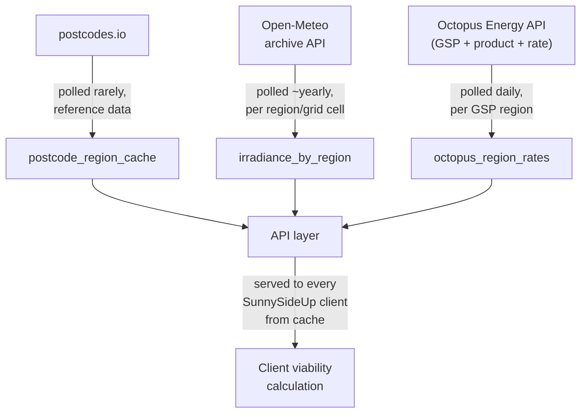

# SunnySideUp — Price Integration Guide

Written for a future engineering team: how the prototype's three live data integrations actually work today, why they don't need a CORS proxy, and what changes to serve real users at scale.

## Why the prototype can fetch real data at all, with no proxy

CORS (Cross-Origin Resource Sharing) is a restriction browsers enforce on requests made from a web page's own JavaScript. It has no effect on a server calling an API directly. A pure static-site prototype with no backend has to work within that restriction, or route around it through a proxy.

All three of the external APIs this calculator actually calls were checked directly, and all three return `Access-Control-Allow-Origin: *`, confirmed via live browser tests and direct curl header checks. That's the reason the prototype fetches real, live data straight from the browser today with no CORS proxy in front of it. A fourth source, PVGIS, was tried first for coordinate-precise solar generation and removed for the opposite reason: it sends no CORS header at all, so a browser blocks it outright regardless of calling origin, a real, confirmed dead end for a backend-less prototype, not a hypothetical one.

## The three live integrations actually in use

**1. postcodes.io** — resolves a UK postcode to country, region, and latitude/longitude. Free, no auth, no API key. `GET https://api.postcodes.io/postcodes/{postcode}`.

**2. Open-Meteo's archive API** — given a latitude/longitude, returns a full past calendar year of hourly global tilted irradiance, which the calculator sums into an annual generation estimate. Free, no auth. Deliberately queries a past, complete calendar year rather than the current one, since Open-Meteo's archive only covers dates that have already happened.

**3. Octopus Energy's public API** — three chained calls, in order: a Grid Supply Point (GSP) lookup resolves a postcode to one of Great Britain's regional electricity market codes (e.g. `_C` for London); a product lookup finds Octopus's current flagship variable-rate product (filtered from the full product list, since Octopus reissues these under a new dated code roughly every quarter as the Ofgem price cap changes); a unit-rate lookup then fetches that product's current price for the resolved region. Free, no auth, no API key.

## Real bugs found integrating these (not a hypothetical contract)

Two real defects surfaced during live end-to-end testing against Octopus's actual API, both fixed and confirmed against real regions:

- The GSP lookup returns a region code with a leading underscore (`_C`), matching the key used inside a product's own rate-lookup object. The tariff-code convention Octopus's *URLs* use, however, is the bare letter with no underscore (`E-1R-VAR-22-11-01-C`, not `...-_C`). Using the underscored value verbatim didn't error, it silently returned a 200 with a "no tariff matches" body instead of a real rate, a genuinely easy-to-miss failure mode.
- Sorting candidate products by most-recently-launched picked whatever niche variable product Octopus happened to launch last (e.g. a smart/time-of-use product), not the actual long-running flagship default most people are actually on. Octopus launches specialty variable tariffs more often than it reissues the flagship one, so recency isn't a reliable proxy for "the standard one." Fixed by matching the flagship product's exact name first, falling back to the recency heuristic only if that product is ever renamed or retired.

## The scaling insight: two shared feeds, one static reference

- **Octopus's regional unit rate is a shared feed**, not a per-customer one: every customer in a given GSP region on that product sees the same price. A production backend needs to poll it on a schedule (e.g. daily) per region, not per user, the same "fetch once, serve everyone" pattern a national shared feed would use, just replicated across Great Britain's 14 GSP regions instead of one single series.
- **Open-Meteo's annual irradiance figure is static historical data**, not live weather: it's a completed past year's total. Safe to precompute once per region (or a coarse coordinate grid) and cache indefinitely, refreshed at most yearly to pick up a newly-completed year.
- **postcodes.io's postcode-to-region mapping is static reference data.** Postcode boundaries change occasionally (new-build postcodes, boundary reviews) but not per request; cache indefinitely with an infrequent refresh, not a live call per user.

## A production architecture sketch



Suggested schema sketch:

```
postcode_region_cache
  postcode, country, region, latitude, longitude, resolved_at

irradiance_by_region
  region_or_grid_cell, annual_kwh_per_m2, source_year, computed_at

octopus_region_rates
  gsp_region_letter, product_code, tariff_code, rate_pence_per_kwh, valid_from, fetched_at
```

## Reliability handling

Each of the three sources can fail or be temporarily unreachable independently. The calculator's current fallback constants (an England-calibrated postcode default, a default annual generation figure, a default electricity price) already express the right pattern for a prototype: try the live source first, fall back to a labeled default rather than an error, and never present a stale or defaulted figure as if it were freshly fetched. A production ingestion job needs the same principle moved server-side: retry with backoff, alert if a region's cache goes stale beyond its expected refresh window, and serve the most recent successfully cached value with a visible "not current" indicator rather than silently substituting the static fallback without saying so.

## Migration checklist, prototype to production

1. Stand up three scheduled ingestion jobs, one per source, each polling server-side (no CORS concern once this moves off the browser).
2. Store the three cache tables above rather than having each client hit the three external APIs directly.
3. Build a thin API layer serving cached, region-keyed data to clients, replacing the prototype's direct-to-source browser fetches.
4. Add alerting per source: Octopus's regional rate cache is the most time-sensitive (daily refresh expectation), postcode and irradiance reference data far less so.
5. Keep the existing static constants as the last-resort fallback tier if the entire cache layer is ever empty, not just as the everyday default.
6. Any future per-user data (a quote upload, a smart-meter or account-linked consumption pull) needs a genuinely different, per-user integration pattern, not this shared/regional caching approach. Out of scope for this guide.

## Status

Reflects how the prototype's three live integrations are actually wired today (25 July 2026 baseline): direct browser fetches to postcodes.io, Open-Meteo, and Octopus Energy's public API, all three confirmed CORS-open, including the two real defects found and fixed during end-to-end testing against Octopus's actual API.
